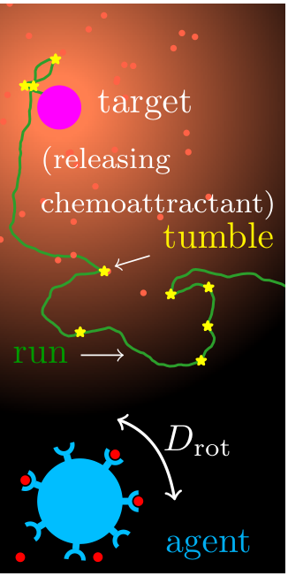
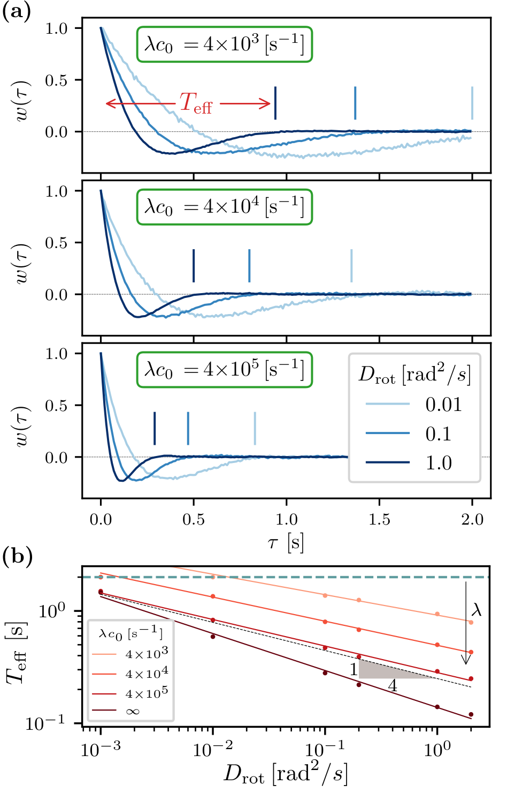

## Run-&-Tumble effective measurement time
What to expect in this project:
- The run-and-tumble motion has been implemented using support vector machine (SVM). 
- The optimal weights for the model are non-zero only for the most recent history of the signal, suggesting an effective measurement time.
- Necessary data to reproduce figure 3 of the manuscript/article -- "Learning run-and-tumble chemotaxis" [Rahul O. Ramakrishnan and Benjamin M. Friedrich](https://link_to_arXiv)
- Source code in Python to reproduce the data

## Motivation
In run-&-tumble chemotaxis, the bacteria (agent) move in a straight line (the "run" phase) and record the binding events of chemoattractant molecules. If they move up the gradient, they prefer to continue in their current direction, but if they move down the gradient, they will randomly change direction (the "tumble" phase) and move in a new direction. This movement allows the bacteria to efficiently explore their environment and locate sources of food. 
<p align="center">
  
</p>
<p align="center">
run-&-tumble chemotaxis
</p>

There are two physical constraints that make chemotaxis more challenging: 
- motility noise, which results from rotational diffusion causing the agents (bacteria) to not move in a straight line, and 
- sensing noise, which occurs when the binding events that make up the signal are stochastic. 

The run-and-tumble mechanism is interesting because of its simplicity, and it is worth exploring whether machine-learning techniques can be used to model it and how well they approximate the benchmark measure. 

## Key result
Because of rotational diffusion, the agent changes direction too quickly and relies only on recent history (past events become irrelevant). The effective measurement time, or how long the agent needs to retain past events, becomes an important factor. We found an empirical relationship for the effective kernel time as a function of rotational diffusion.

## Usage
To reproduce the figures, run the Python script as
```
python document.py
```
which will generate `figure3.eps` in the working directory and some additional figures inside the directory `fig` <br>
Necessary data has already been provided in the directory `data`

To reproduce the entire data (this will take several hours), one may start afresh by cleaning the directory `data` and run the main Python script as:
```
python main.py
```

If necessary, modify the current settings/parameters  specified in
```
inputs.py
```
before running the `main.py`.

## Outcome
If run correctly, the expected figure would be:

<p align="center">
  
</p>
<p align="center">
Figure 3. (a) Weight profiles. (b) Effective measurement time
</p>

[Additional information](additional_info.md)
