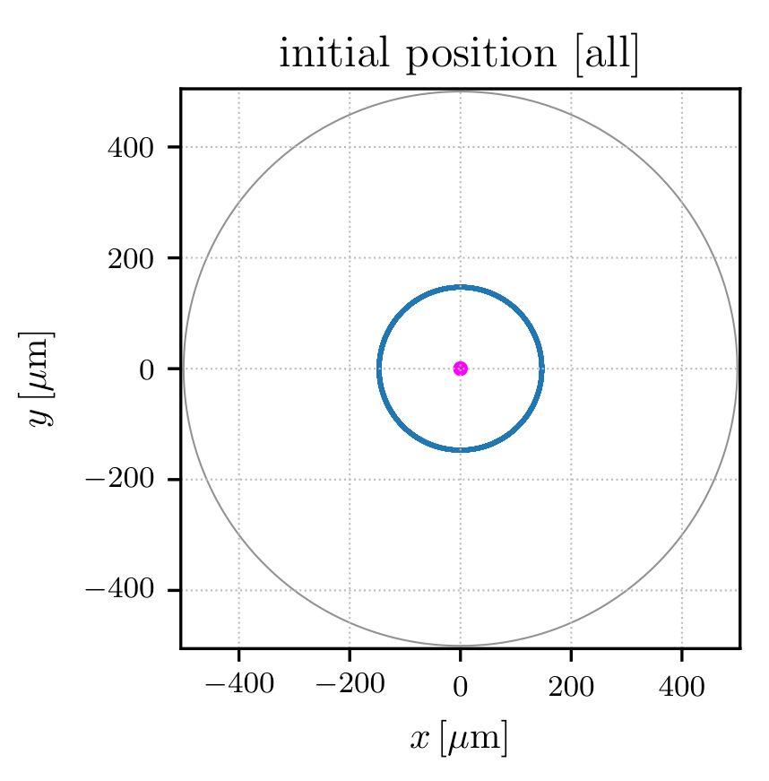
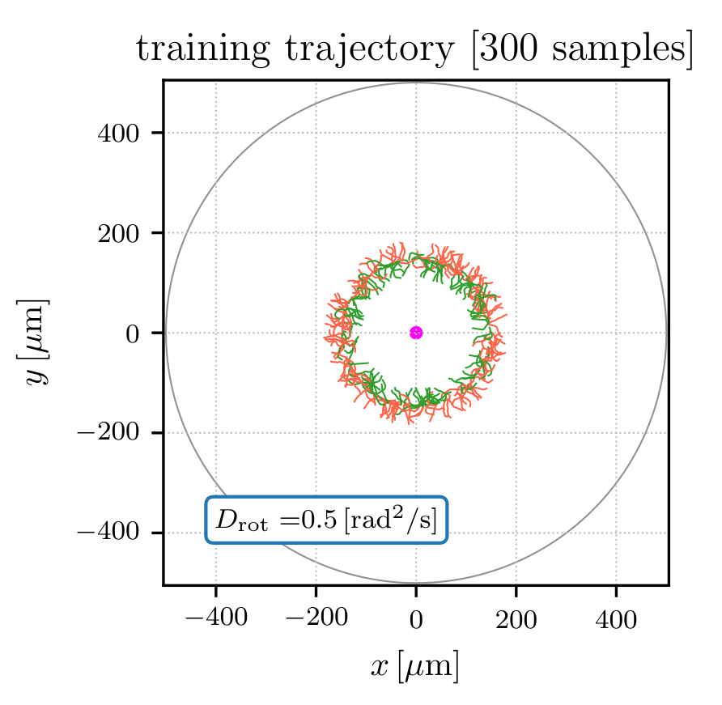
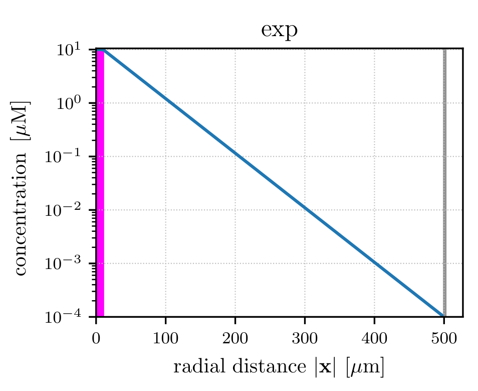
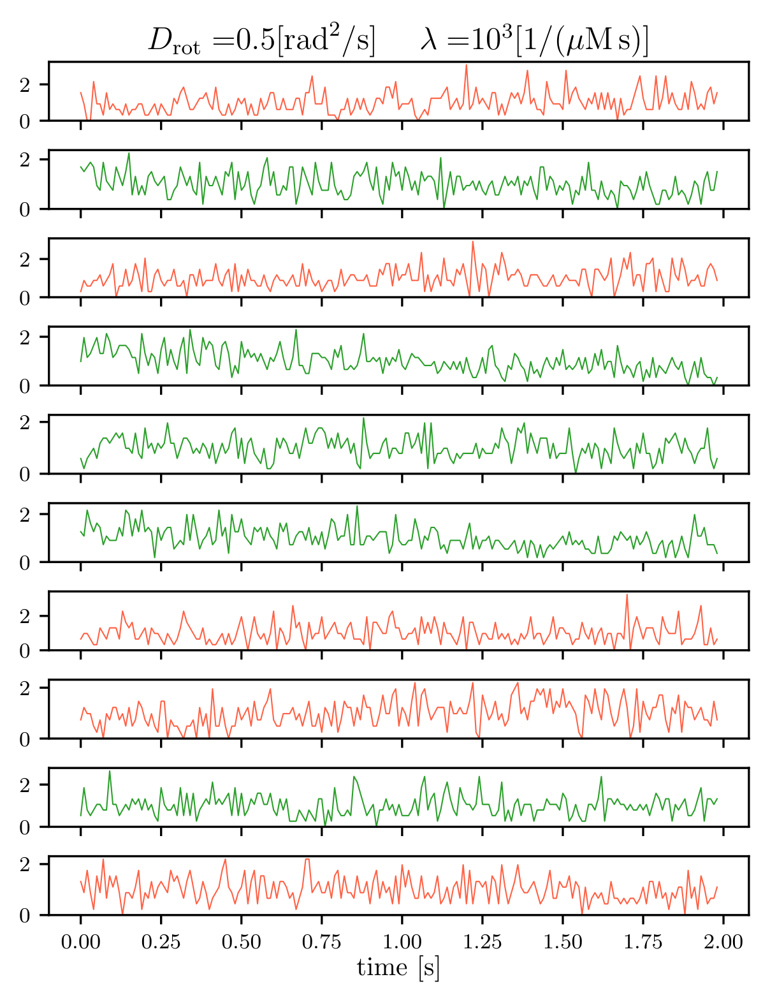
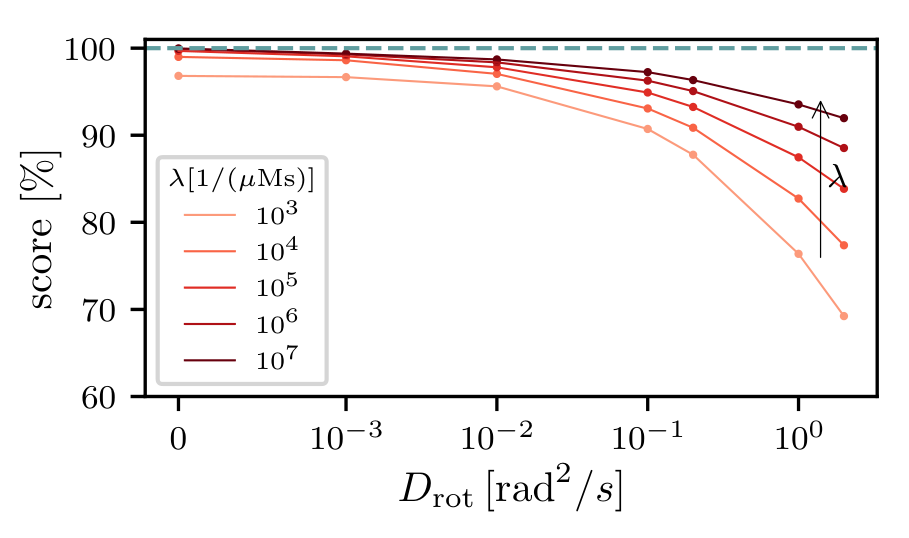

## Training trajectories
 

   
   
   

In this task, we start all the tranining trajectories at a fixed radial distance (left). Sample trajectories are shown here for a short run of $T_{\mathrm{max}} = 1$ s (right). Target is at the center which has a finite radius shown in color-magenta. Supervised learning 

 

   

 

   

 

   

