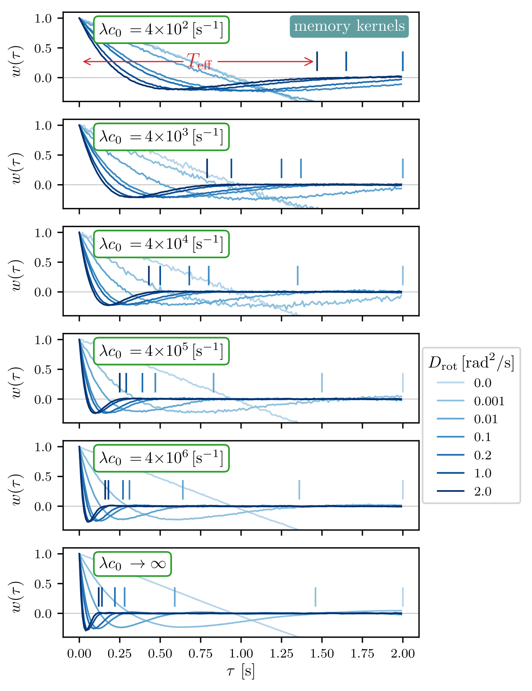
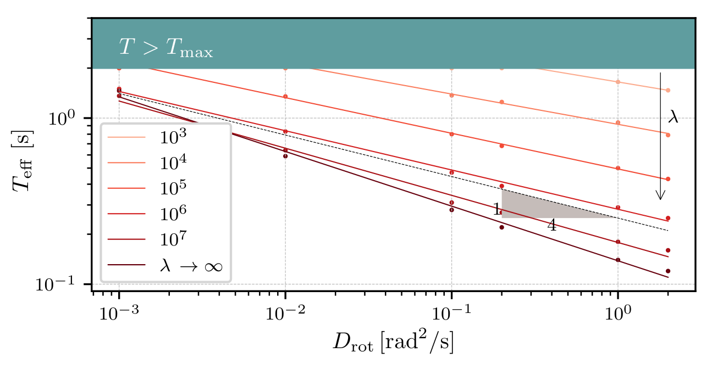

## Training trajectories
 

  
  
  

Instead of using uniformly distributed trajectories for training, here we use a special case of trajectories.  i.e., starting point of the trajectories are at a fixed radial distance $R_0$ from the center.

 

  

Sample signal -- normalized, $s(t) \lvert s \rvert $

 

  

Weight profiles --- complete figure; Selected rows are shown in Figure 3 of the manuscript.

 

Effective measurement time --- complete figure; Selected lines are shown in Figure 3 of the manuscript.

 

  

Score shows the fraction of predictions that are accurate when using previously unseen data. 

